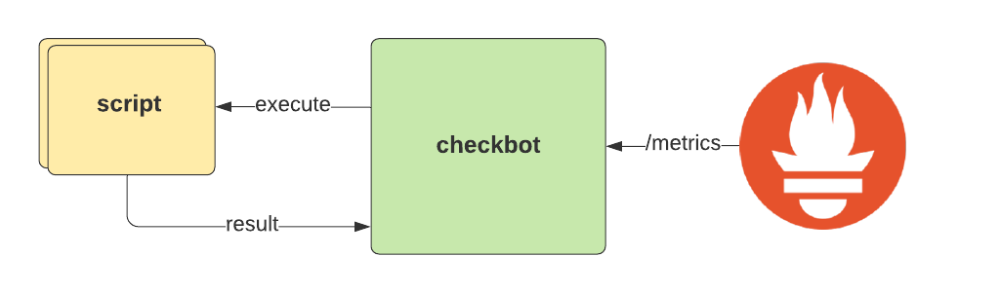

# checkbot


## Overview

Checkbot is able to run custom shell scripts in a container running on Openshift or Kubernetes. Use different tools to highly customize your checks (e.g. functionality, compliance, security). The result of such scripts are then exposed as Prometheus metrics with your own appropriate labels to provide detailed information about your check.



A check can be implemented as simple script where you use tools to test a desired state. The result of the script has to meet a defined output format. Checkbot will regularly run the script and transform the result to a valid Prometheus metric.

## Example

Checks are written in Bash and will provide results in form of one [type of metric](https://prometheus.io/docs/concepts/metric_types/).

```
#!/bin/sh

# ACTIVE true
# TYPE Gauge
# HELP Check if all projects have quotas defined.
# INTERVAL 60

set -eu

# file1 contains all projects
oc get project --no-headers | awk '{print $1}' | sort > /tmp/file1

# file2 contains all quotas
oc get quota --all-namespaces --no-headers | awk '{print $1}' | sort| uniq > /tmp/file2

# result contains projects without quotas
comm -3 /tmp/file1 /tmp/file2 > /tmp/result

# looping through results
while IFS="" read -r p || [ -n "$p" ]
do
  printf '1|project=%s\n' "$p"
done < /tmp/result

exit 0
```

Checkbot will then read the result and convert it into the appropriate Prometheus metric that can be scraped for later usage:

```
# HELP checkbot_missing_quota_on_project_total Check if all projects have quotas defined.
# TYPE checkbot_missing_quota_on_project_total gauge
checkbot_missing_quota_on_project_total{project="grafana"} 1
checkbot_missing_quota_on_project_total{project="kube-dns"} 1
checkbot_missing_quota_on_project_total{project="test"} 1
```

More information about writing your custom checks can be found at [Writng Checks](docs/checks.md).

## Installation

Check [Setup](docs/setup.md) and [Configuration](docs/configuration.md) for further instructions on how to install checkbot on Openshift or Kubernetes. There is also a prebuilt image available:

```
docker pull tobiasdenzler/checkbot:latest
```

